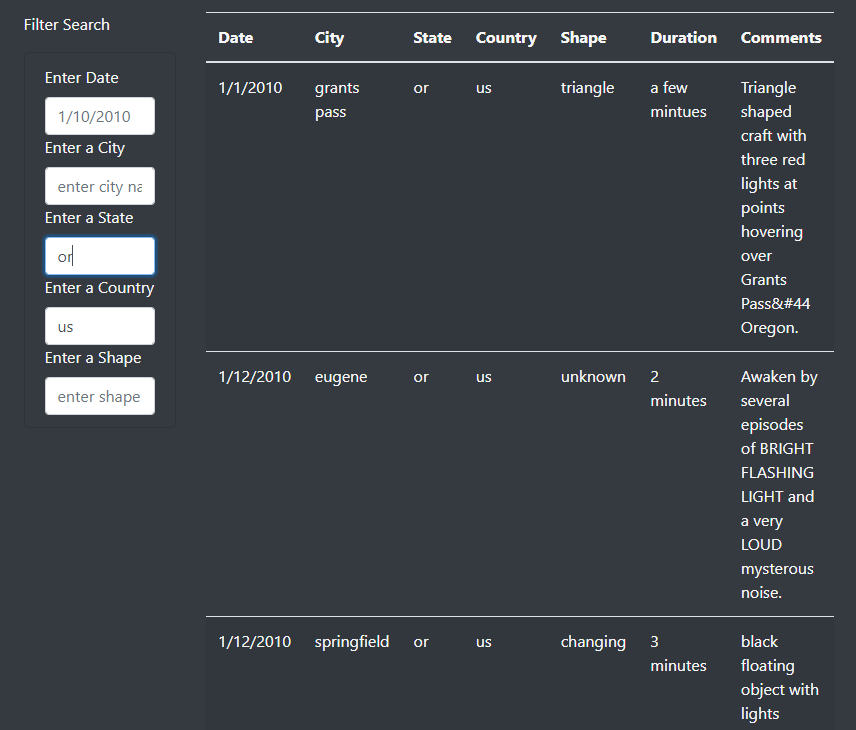

# UFO-Finder
Java Script and HTML

**Overview of Project:**

I am helping a data journalist "Dana" to filter a large data set about UFO sightings around the nation which is stored in a .js format, I have created a web page to display the data in a html table format for easy reading.

**Results:**

The data is store in data.js file , I have written the html code for the page displayed below , we can filter the data based on Date,City,State ,Country and Shape of UFO. Dana is trying to write an article on UFO sighting in her hometown Mcminnville ,Oregon. She can filter the data and start writting the article now.

**Summary:**

The one drawback of this webpage, Dana the data journalist wanted to write about the UFO in her home town Mcminnvile-Oregon , however there are no UFO data for this particular location.

The web page can be improved by adding count of UFO data when we filter if the data gets large ,people cant manually count the filtered results. I would like to add more data to the data.js file as 'Dana' wanted to write about the UFO sightings in her hometown and we do not have enough data to start writing article about Mcminnvile,Oregon.
